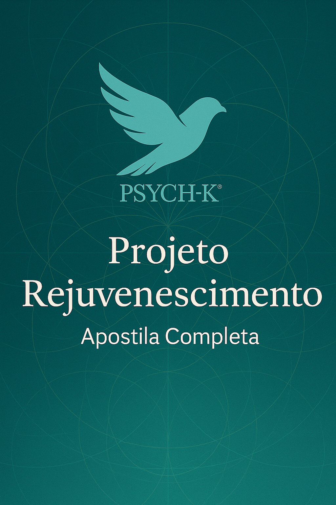

# Projeto Rejuvenescimento - Apostila Completa

*Material didático baseado na série de 30 vídeos sobre rejuvenescimento através da metodologia PSYCH-K®*

---

## Índice

- [Projeto Rejuvenescimento - Apostila Completa](#projeto-rejuvenescimento---apostila-completa)
  - [Índice](#índice)
  - [Vídeo 01: Rejuvenescer ou Não Rejuvenescer - Essa é a Questão](#vídeo-01-rejuvenescer-ou-não-rejuvenescer---essa-é-a-questão)
  - [Vídeo 02: Journaling - O Poder do Registro Diário](#vídeo-02-journaling---o-poder-do-registro-diário)
  - [Vídeo 03: As 3 Atividades Diárias Ultra-Secretas](#vídeo-03-as-3-atividades-diárias-ultra-secretas)
  - [Vídeo 04: Os Ganhos Secundários](#vídeo-04-os-ganhos-secundários)
  - [Vídeo 05: Sua Majestade - O Balance de Saúde e Bem-Estar Ideal](#vídeo-05-sua-majestade---o-balance-de-saúde-e-bem-estar-ideal)
  - [Vídeo 06: Sua Majestade - O Balance de Vida Alternativa](#vídeo-06-sua-majestade---o-balance-de-vida-alternativa)
  - [Vídeo 07: O Balance de Relacionamento "Nu"](#vídeo-07-o-balance-de-relacionamento-nu)
  - [Vídeo 08: Balance de Relacionamento com Vida e Morte](#vídeo-08-balance-de-relacionamento-com-vida-e-morte)
  - [Vídeo 09: Merlin, Onde Você Está? - Joint Surrogation com a Fonte de Rejuvenescimento](#vídeo-09-merlin-onde-você-está---joint-surrogation-com-a-fonte-de-rejuvenescimento)
  - [Vídeo 10: Simples é Divino - Alinhamento com a Perfeição Divina](#vídeo-10-simples-é-divino---alinhamento-com-a-perfeição-divina)
  - [Vídeo 11: Seu Subconsciente Ama Símbolos - Balance com o Símbolo Antienvelhecimento](#vídeo-11-seu-subconsciente-ama-símbolos---balance-com-o-símbolo-antienvelhecimento)
  - [Vídeo 12: Você Achou que Eu Esqueci? - Os Princípios da Natureza](#vídeo-12-você-achou-que-eu-esqueci---os-princípios-da-natureza)
  - [Vídeo 13: O Tempo é uma Ilusão - Eu Futuro Parte 1](#vídeo-13-o-tempo-é-uma-ilusão---eu-futuro-parte-1)
  - [Vídeo 14: O Tempo é Real - Eu Futuro Parte 2](#vídeo-14-o-tempo-é-real---eu-futuro-parte-2)
  - [Vídeo 15: Tempo, Oh Tempo - A Linha do Tempo](#vídeo-15-tempo-oh-tempo---a-linha-do-tempo)
  - [Vídeo 16: Tempo Estranho](#vídeo-16-tempo-estranho)
  - [Vídeo 17: Ei, Fonte de Energia Vital - Vamos Conversar](#vídeo-17-ei-fonte-de-energia-vital---vamos-conversar)
  - [Vídeo 18: Eu Gosto de Perguntas - Pergunta #1](#vídeo-18-eu-gosto-de-perguntas---pergunta-1)
  - [Vídeo 19: Eu Amo Perguntas - Outras Perguntas](#vídeo-19-eu-amo-perguntas---outras-perguntas)
  - [Vídeo 20: Sou Viciado em Perguntas - Mais Uma](#vídeo-20-sou-viciado-em-perguntas---mais-uma)
  - [Vídeo 21: Não Posso Viver Sem Perguntas - A Última, Prometo](#vídeo-21-não-posso-viver-sem-perguntas---a-última-prometo)
  - [Vídeo 22: Ei, É Tudo Sobre Servir](#vídeo-22-ei-é-tudo-sobre-servir)
  - [Vídeo 23: Nosso Amado TPS](#vídeo-23-nosso-amado-tps)
  - [Vídeo 24: Psst... Preste Atenção à Sua Reação - Parte 1](#vídeo-24-psst-preste-atenção-à-sua-reação---parte-1)
  - [Vídeo 25: Psst... Preste Atenção à Sua Reação - Parte 2](#vídeo-25-psst-preste-atenção-à-sua-reação---parte-2)
  - [Vídeo 26: Família, Família, Família...](#vídeo-26-família-família-família)
  - [Vídeo 27: Crenças Coletivas - Sociedade, Oh Sociedade](#vídeo-27-crenças-coletivas---sociedade-oh-sociedade)
  - [Vídeo 28: Suas Crenças - Eu, Oh Eu](#vídeo-28-suas-crenças---eu-oh-eu)
  - [Vídeo 29: Depois da Floresta, as Árvores Também Precisam de Atenção - Células e Telômeros](#vídeo-29-depois-da-floresta-as-árvores-também-precisam-de-atenção---células-e-telômeros)
  - [Vídeo 30: Obrigado](#vídeo-30-obrigado)

---

## Vídeo 01: Rejuvenescer ou Não Rejuvenescer - Essa é a Questão

**Queridos Facilitadores Divinos,**

Finalmente, bem-vindos ao **Projeto Rejuvenescimento**! 

Este primeiro vídeo aborda a questão fundamental: rejuvenescer ou não rejuvenescer?

### A Pergunta Essencial

Uma das principais perguntas que farei é: **Por que você quer rejuvenescer?**

Estamos aqui para servir. Quando servimos o universo como nosso objetivo principal, o universo nos serve em retorno. O universo precisa que sejamos saudáveis e conscientemente despertos para apoiá-lo em seu crescimento e exploração.

### Compromisso Inicial

Este é um presente nosso como Centro Internacional, mas também precisamos da sua colaboração:

📸 **Documentação Fotográfica:**
- Tire uma foto de si mesmo **antes de começar** o programa
- Tire uma nova foto **a cada mês** por pelo menos 6 meses
- Vamos iniciar com um teste de 6 meses para observar os resultados

Esta documentação será valiosa para demonstrar como podemos usar esta metodologia espiritual para viver uma vida plena e vibrante até o último momento.

### Princípios Fundamentais

**1. Ação é Essencial**
Lembrem-se: não se trata apenas de fazer balanceamentos. **Tomem ações concretas!** Muitas ações surgirão naturalmente do processo.

**2. Profundidade sobre Velocidade**
- Permaneçam em cada procedimento o tempo necessário
- Não se apressem nem sejam superficiais
- Cada vídeo pode ser fonte de múltiplos balanceamentos
- Mantenham-se humildes e curiosos
- Este não é um desafio ou competição

**3. Processo Sagrado**
Se abordarem este programa como uma corrida, perderão uma oportunidade incrível de transformação - não apenas para vocês, mas também para família e amigos.

### Benefícios Esperados

Este programa pode trazer mudanças profundas em várias áreas:
- ✨ Maior felicidade e saúde
- 🎯 Mais paz interior
- 💼 Transformações no trabalho
- ❤️ Melhoria nos relacionamentos
- 🌟 Evolução espiritual

### Importante: A Abordagem Correta

⚠️ **Este NÃO é um programa de "técnica rápida" de rejuvenescimento!**

Se estão procurando uma solução instantânea, este não é o programa adequado. PSYCH-K® não é uma técnica rápida - é um processo profundo de transformação.

### A Jornada Espiritual

Esta é uma jornada para lembrar quem vocês realmente são: **seres espirituais tendo uma experiência humana**.

Quando estamos 100% conscientes desta verdade, o rejuvenescimento é uma consequência natural.

### Como Abordar o Programa

✅ **Faça com amor e alegria** para si mesmo e outros
❌ **NÃO faça por medo** da morte ou do envelhecimento

**Objetivo:** Não é viver 200 anos, mas chegar ao último dia desta experiência física da melhor forma possível - mental, emocional, física e espiritualmente.

### Rejuvenescimento vs. Anti-envelhecimento

Este programa é sobre **REJUVENESCIMENTO**, não anti-envelhecimento. Sempre declaramos para onde queremos ir, não de onde queremos fugir. Buscamos rejuvenescimento com sabedoria.

> **Fórmula Secreta:** Quanto mais conectados ao nosso espírito e servindo o universo, mais o universo nos serve. **SERVIÇO** é a chave do rejuvenescimento.

### Balanceamento Sugerido

Se sentirem necessidade, podem balancear a declaração:
> "Eu faço este projeto com amor e alegria para mim mesmo"

### Liberdade Criativa

Este programa oferece muitos vídeos, sugestões, perguntas e protocolos. Se tiverem ideias adicionais que não estão no programa, sintam-se livres para implementá-las!

### Compromisso e Disciplina

📅 **Essenciais para o sucesso:**
- Compromisso diário com o processo
- Disciplina para dedicar tempo a si mesmo
- Regularidade na prática

**Sem desculpas!** Se sua saúde, evolução pessoal/espiritual e serviço são importantes, você TEM tempo. Acorde mais cedo se necessário. Bloqueie um horário na agenda exclusivamente para você.

### Sobre o Material

O programa é baseado no material mais atualizado de PSYCH-K®. Se não tiverem algum protocolo específico mencionado, simplesmente pulem - há muitas outras atividades e isso não afetará o processo geral.

### Próximos Passos

1. 📸 Tire sua primeira foto
2. 🎯 Comprometa-se com o processo
3. 💫 Prepare-se para esta bela aventura

**Grande abraço e nos vemos no próximo vídeo!**

---

## Vídeo 02: Journaling - O Poder do Registro Diário

Bem-vindos ao vídeo número 2!

### A Importância do Registro

É fundamental para nossa mente consciente **documentar e registrar** estas experiências do programa. O journaling (registro em diário) pode ser feito em:
- 📓 Caderno físico
- 📱 Dispositivo eletrônico

### Minha Experiência Pessoal

Pessoalmente, uso meu iPhone porque nem sempre tenho um caderno físico comigo. Descobri que posso encontrar insights sobre rejuvenescimento mesmo quando não estou em casa.

**Tentativa inicial:** Comecei usando o app Notas, mas não funcionou bem porque uso muito este aplicativo e ficava difícil encontrar as anotações específicas do processo de rejuvenescimento.

**Solução encontrada:** Baixei um aplicativo gratuito de diário na App Store. O app que uso chama-se **"Diario"** (disponível em vários idiomas incluindo português, espanhol, inglês e alemão).

- **Desenvolvedor:** Fun Younger (F-U-N Y-U-N-G-E-R)
- **Categoria:** Journal/Diário
- **Versão:** Gratuita (suficiente para nossas necessidades)

### Benefícios do Registro Digital

- ✅ Fácil de usar
- ✅ Sempre acessível
- ✅ Ajuda a manter consistência
- ✅ Facilita o acompanhamento diário

### Diferencial deste Processo

Diferentemente de outros processos com PSYCH-K® onde simplesmente fazemos o balanceamento e seguimos em frente, no **Projeto Rejuvenescimento** é essencial:

1. **Registrar cada balanceamento**
2. **Acompanhar o progresso**
3. **Manter disciplina e consistência**

### Dica Prática

Coloquei o ícone do app na **tela principal** do meu telefone. Isso serve como:
- 🔔 Lembrete visual diário
- ⚡ Acesso rápido
- 💡 Motivação para manter a prática

Se em algum dia eu esquecer de fazer minhas três atividades sagradas (que veremos no próximo vídeo), o ícone me lembra imediatamente.

### Estrutura do Registro

Você registrará:
- **Atividades únicas** (feitas apenas uma vez)
- **Atividades diárias** (repetidas dia após dia)

### Conclusão

Encontre o melhor método para documentar sua jornada de rejuvenescimento. O importante é manter um registro consistente que funcione para você.

**Nos vemos no próximo vídeo!**

---

## Vídeo 03: As 3 Atividades Diárias Ultra-Secretas

Bem-vindos ao vídeo número 3!

Hoje vou compartilhar as **três atividades diárias fundamentais** que são a base do nosso processo de rejuvenescimento.

### Atividade #1: Balance de Bem-Estar

**O procedimento de Bem-Estar** (Whole-Wellness Process) é, na minha experiência, o melhor procedimento de rejuvenescimento disponível.

🔑 **Essencial:** 
- Faça DIARIAMENTE
- Reserve tempo exclusivo para você
- Sem desculpas!

Pode ser feito:
- De manhã
- À tarde  
- À noite

O importante é a **consistência diária**.

### Atividade #2: Balanceamento de Mensagens sobre Condições

Esta atividade diária foca nas **mensagens sobre condições** - ou seja, qualquer:
- Dificuldade
- Resistência  
- Conflito

...que você tenha relacionado ao rejuvenescimento.

**Como funciona:**
- Alguns dias você não terá mensagens
- Outros dias terá uma, duas ou três mensagens
- Verifique DIARIAMENTE

> 💡 **Lembre-se:** A cada dia somos seres renovados, prontos para receber novas mensagens e descobrir mais sobre este processo de rejuvenescimento.

### Atividade #3: Mensagens sobre a Situação Específica

A situação específica é: **"A ilusão de separação e a dificuldade em lembrar que você é um ser espiritual tendo uma experiência humana"**

**Procedimento:**
- Identifique esta situação
- Siga o protocolo de mensagens para ela
- Pratique diariamente

### Resumo das 3 Atividades Diárias

1. ✨ **Balance de Bem-Estar** 
2. 💬 **Mensagens sobre Condições** (resistências ao rejuvenescimento)
3. 🌟 **Mensagens sobre a Ilusão de Separação**

Estas três práticas formam a **base sólida** do seu processo diário de rejuvenescimento.

**Vejo você no próximo vídeo!**

---

## Vídeo 04: Os Ganhos Secundários

Bem-vindos ao vídeo número 4!

### O Poder dos Ganhos Secundários

Os ganhos secundários são extremamente importantes no processo de transformação. Vou compartilhar duas perguntas poderosas que nos ajudarão a identificar e transformar esses padrões ocultos.

### Como Trabalhar com as Perguntas

**Processo passo a passo:**

1. 🎯 Farei uma pergunta
2. ⏸️ Pause o vídeo
3. 👂 Escute a resposta que surgir
4. ⚖️ Faça o balanceamento necessário
5. 🔄 Repita a mesma pergunta
6. ✅ Continue até esgotar todas as respostas

Quando não houver mais ganhos secundários para a primeira pergunta, passe para a segunda.

### Pergunta #1

> **"O que você perderá se rejuvenescer?"**

Escute atentamente a resposta. Se surgir algum ganho secundário, você sabe como proceder com o balanceamento.

Repita esta pergunta várias vezes até não obter mais respostas.

### Pergunta #2

> **"Qual é a vantagem de envelhecer?"**

Siga o mesmo processo: escute, balance, repita.

### Minha Experiência Pessoal

Compartilho meus próprios ganhos secundários descobertos durante o workshop de Saúde e Bem-Estar:

**Sobre a Pergunta 1:**
- **Medo:** Perder minha sabedoria
- **Crença limitante:** Se rejuvenescer, perderei minha sabedoria
- **Solução/Balance:** "Quanto mais eu rejuvenesço, mais sábio me torno e mais mantenho minha sabedoria"

**Sobre a Pergunta 2:**
- **Descoberta:** "As pessoas me deixarão em paz porque sou velho"
- **Balance:** "Quanto mais rejuvenesço, mais em paz eu sou e mais em paz minha vida está"

### Importante Lembrar

✨ Estes são apenas exemplos. Seus ganhos secundários serão únicos e pessoais.

🔄 **Você pode retornar a este vídeo** a qualquer momento do programa, pois com o tempo e evolução, novos ganhos secundários podem surgir.

### Trabalho Profundo

Dedique tempo para:
- Identificar TODOS os ganhos secundários
- Transformá-los completamente
- Não prosseguir até estar completo com este processo

**Vejo você no próximo vídeo!**

---

## Vídeo 05: Sua Majestade - O Balance de Saúde e Bem-Estar Ideal

Bem-vindos ao vídeo número 5!

### O Balance Fundamental

Hoje trabalharemos com **Sua Majestade**, o Balance de Saúde e Bem-Estar Ideal, mas com uma intenção específica e um objetivo claro.

### Definindo a Intenção

**Importante:** Não é uma declaração de objetivo formal, mas sim estabelecer uma intenção clara:

> 🎯 **Intenção:** "Faço este balance para meu rejuvenescimento"

Similar ao que fazemos com o Balance de Vida Alternativa, estabelecemos uma intenção positiva e clara. Aqui, a intenção é especificamente voltada para o rejuvenescimento.

### O Processo

Este balance maravilhoso ajudará você a:
- 🔍 Identificar todas as fraquezas em seu sistema relacionadas ao rejuvenescimento
- 💪 Transformar essas fraquezas em forças
- 📋 Descobrir ações práticas necessárias

### Opções de Facilitação

**Ideal:** Fazer com outro facilitador que tenha participado do programa de Saúde e Bem-Estar

**Alternativa:** Fazer o processo sozinho (auto-facilitação)

### A Fórmula do Sucesso

Lembramos do workshop básico que:

> **Resultados = Potencial + AÇÕES**

Para o rejuvenescimento, não basta apenas fazer balanceamentos. É essencial também **tomar muitas ações** para mudar aspectos da nossa vida que nos ajudarão a:
- Rejuvenescer
- Ser e permanecer saudáveis
- Viver plenamente até o último momento

### Descobrindo Ações Práticas

O Balance de Saúde e Bem-Estar Ideal nos ajudará tremendamente a definir:
- ✅ Todas as etapas de ação necessárias
- ✅ Mudanças práticas no estilo de vida
- ✅ Novos hábitos a desenvolver

### Dedicação Necessária

⏰ **Reserve tempo adequado:**
- Não se apresse
- Esta pode ser a ÚNICA atividade do dia
- Vale a pena dedicar cada momento
- Dê atenção especial às etapas de ação

### Conclusão

Faça este balance com calma e profundidade. Descubra tudo que você precisa para seu processo de rejuvenescimento.

**Aproveite e te vejo no próximo vídeo!**

---

## Vídeo 06: Sua Majestade - O Balance de Vida Alternativa

Bem-vindos ao vídeo número 6!

### O Balance de Vida Alternativa

Hoje trabalharemos com outro balance fundamental: **Sua Majestade, o Balance de Vida Alternativa**.

### Opções de Facilitação

Você pode:
- 👥 Receber este balance de outro facilitador (que tenha participado do programa de Saúde e Bem-Estar)
- 🧘 Fazer o processo sozinho (auto-facilitação)

### A Intenção Específica

Para este Balance de Vida Alternativa, estabeleça a seguinte intenção:

> 🌟 **"Rejuvenescer e criar uma nova realidade onde o rejuvenescimento é tão normal quanto o envelhecimento é na realidade atual"**

### O Objetivo

Visualize e crie uma realidade onde você:
- ✨ Chega ao último momento de vida em estado fabuloso
- 💫 Mantém forma divina e saudável
- 🎯 Permanece íntegro em todos os níveis

### Descobrindo Novas Ações

Este balance pode revelar novas oportunidades de ação, especialmente:
- **No passo 4** do processo
- **No passo 5** do balance

### Integrando com o Trabalho Anterior

📝 **Dica importante:** 
As novas ações descobertas neste balance podem ser adicionadas à lista de ações que você desenvolveu no vídeo anterior (Balance de Saúde e Bem-Estar).

### Processo Completo

1. Estabeleça a intenção clara
2. Realize o balance completo
3. Preste atenção especial aos insights
4. Anote todas as ações práticas que surgirem
5. Integre com seu plano de ação geral

**Aproveite este processo e até o próximo vídeo!**

---

## Vídeo 07: O Balance de Relacionamento "Nu"

Bem-vindos ao vídeo número 7!

### Uma Atividade Transformadora

Esta é uma atividade muito interessante e profunda: fazer um **Balance de Relacionamento com você mesmo**, nu, diante do espelho.

### O Processo

**Foco principal:** Concentre-se em todos os aspectos do seu corpo que você associa ao envelhecimento ou que não aceita:
- Cabelos brancos
- Gordura localizada
- Flacidez dos tecidos
- Manchas na pele
- Qualquer outro aspecto

### Procedimento Detalhado

1. **Preparação:**
   - Fique nu diante do espelho
   - Antes de iniciar o balance, observe profundamente
   - Escaneie e identifique todas as partes que você não gosta ou não aceita
   - Especialmente aquelas relacionadas ao processo de envelhecimento

2. **Execução do Balance:**
   - Estabeleça comunicação (como sempre)
   - Obtenha permissão ou compromisso
   - Faça o pré-teste (30 segundos)
   - Prossiga com todo o protocolo padrão

### A Importância da Paz Interior

> 💝 **Verdade fundamental:** Estar em paz com quem somos é CRUCIAL para evoluir

Se permanecermos:
- Em guerra com nosso corpo
- Em conflito com nossa imagem
- Rejeitando nossa percepção de nós mesmos

...será muito difícil evoluir e rejuvenescer.

### Transformação Profunda

Este balance oferece a oportunidade de:
- ✨ Aceitar-se completamente
- 🕊️ Fazer as pazes com seu corpo
- 💫 Transformar a relação consigo mesmo
- 🌟 Abrir caminho para o rejuvenescimento

### Conclusão

Esta é uma prática poderosa de autoaceitação e transformação. Permita-se este momento de honestidade e cura.

**Aproveite e te vejo no próximo vídeo!**

---

## Vídeo 08: Balance de Relacionamento com Vida e Morte

Bem-vindos ao vídeo número 8!

### A Dualidade Fundamental

Vida e morte estão intimamente relacionadas aos processos de rejuvenescimento e envelhecimento. Hoje exploraremos essa dualidade através de dois balanceamentos poderosos.

### Balance de Relacionamento com a VIDA

**Por que fazer?**
Precisamos investigar: você realmente quer viver? Ou existe alguma parte sua que deseja "sair"? O envelhecimento pode ser funcional para esse desejo inconsciente.

**Processo:**
1. Peça a outra pessoa para fazer surrogate do arquétipo da Vida
2. Realize o Balance de Relacionamento
3. Identifique e transforme qualquer fraqueza

💡 **Nota:** Esse tema pode estar relacionado ao "Eu quero morrer forte" identificado no Balance de Saúde e Bem-Estar Ideal.

### Balance de Relacionamento com a MORTE

**Por que fazer?**
- Quanto mais tememos a morte, mais poder damos a ela
- Quanto mais energia direcionamos ao medo, mais o alimentamos

**Processo:**
1. Peça a alguém para fazer surrogate do arquétipo da Morte
2. Realize o Balance de Relacionamento
3. Transforme qualquer medo ou resistência

### A Importância destes Balances

Estes balanceamentos nos ajudam a:
- ✨ Estar em paz com o ciclo natural da existência
- 💪 Remover medos inconscientes que aceleram o envelhecimento
- 🌟 Abraçar plenamente a vida
- 🕊️ Aceitar a morte sem temor

### Reflexão

Quando estamos em paz tanto com a vida quanto com a morte, liberamos energia vital que antes estava presa em medos e resistências. Essa energia pode então ser direcionada para o rejuvenescimento.

**Aproveite estes balanceamentos profundos e vejo você no próximo vídeo!**

---

## Vídeo 09: Merlin, Onde Você Está? - Joint Surrogation com a Fonte de Rejuvenescimento

Bem-vindos ao vídeo número 9!

### O Poder da Joint Surrogation

Nesta atividade, utilizaremos o protocolo de **Joint Surrogation com a Fonte de Poder** - um processo profundo de conexão e alinhamento.

### Escolhendo sua Fonte

Reflita: **Quem ou o que melhor representa o rejuvenescimento ou a fonte de rejuvenescimento para você?**

Pode ser:
- 🧙‍♂️ Um arquétipo (como Merlin)
- 🌟 Uma energia específica
- 💫 Um símbolo pessoal
- ✨ Qualquer representação que ressoe com você

### O Protocolo

1. **Identifique** sua fonte de rejuvenescimento
2. **Conecte-se** através do protocolo de Joint Surrogation
3. **Integre** a energia e sabedoria desta fonte

### Flexibilidade do Processo

🔄 **Este não é um processo único!**

Você pode:
- Repetir sempre que sentir necessidade
- Mudar a fonte de rejuvenescimento se encontrar algo mais poderoso
- Adaptar conforme sua evolução no programa

### Evolução Contínua

À medida que você avança em sua jornada, pode descobrir:
- Novas fontes que ressoam mais profundamente
- Diferentes aspectos do rejuvenescimento
- Conexões mais poderosas em momentos específicos

### Dica Prática

Mantenha-se aberto e receptivo. A fonte de rejuvenescimento que escolher hoje pode não ser a mesma daqui a algumas semanas - e isso é perfeitamente natural!

**Aproveite esta conexão profunda e te vejo no próximo vídeo!**

---

## Vídeo 10: Simples é Divino - Alinhamento com a Perfeição Divina

Bem-vindos ao vídeo número 10!

### A Simplicidade do Divino

Hoje trabalharemos com um protocolo elegante em sua simplicidade: o **Alinhamento com a Perfeição Divina**.

### O Processo

É maravilhosamente direto:

1. 🎯 **Defina a situação:** "Envelhecimento"
2. ✨ **Aplique o protocolo:** Alinhamento com a Perfeição Divina
3. 🙏 **Permita a transformação**

### A Beleza da Simplicidade

Este protocolo nos lembra que:
- As soluções mais profundas são muitas vezes as mais simples
- A perfeição divina já existe em nós
- Precisamos apenas nos alinhar com ela

### Reflexão

Quando nos alinhamos com a perfeição divina, transcendemos as limitações da percepção humana sobre envelhecimento e abrimos espaço para o rejuvenescimento natural.

**Aproveite este processo simples e profundo!**

**Vejo você no próximo vídeo!**

---

## Vídeo 11: Seu Subconsciente Ama Símbolos - Balance com o Símbolo Antienvelhecimento

Bem-vindos ao vídeo número 11!

### O Poder dos Símbolos

Nosso subconsciente se comunica através de símbolos. Hoje utilizaremos um símbolo poderoso encontrado em um baralho especial de cartas terapêuticas.

### Sobre o Baralho

**Nome:** "Símbolos para Terapias com Círculos de Cultivo" (Crop Circles)
- 📚 36 símbolos relacionados a diferentes órgãos e sistemas do corpo
- 🌾 Baseado em círculos de cultivo
- 🎴 Inclui um símbolo específico para antienvelhecimento

💡 **Dica:** Procure na Amazon se desejar adquirir o baralho completo em seu idioma.

### O Protocolo - Balance de Nova Direção

Para este símbolo, usaremos o **Balance de Nova Direção** (New Direction Balance) - o protocolo preferido em 99,9% dos casos para transformação de percepção.

### Processo Passo a Passo

1. **Preparação:**
   - Defina a intenção de manter tudo simples
   - Não complique procurando um Balance de Crença Central

2. **Estabeleça comunicação**

3. **Pré-teste com o símbolo:**
   - Olhos abertos, olhando para baixo
   - Observe o símbolo por alguns segundos até conectar-se
   - Faça o teste muscular (sempre com olhos abertos)
   - Pause o vídeo para manter a imagem visível

4. **Se o pré-teste for fraco:**
   - Indica estresse/não integração com o símbolo antienvelhecimento
   - Prossiga com permissão/compromisso
   - Teste preferência de crossover

5. **Durante o Balance:**
   - **IMPORTANTE:** Mantenha os olhos ABERTOS no símbolo
   - Permaneça na postura de cérebro integrado
   - Não repita nada, não pense em nada
   - Apenas observe o símbolo
   - Sua mente subconsciente fará todo o trabalho necessário

6. **Conclusão:**
   - Aguarde a mudança (emocional/física/mental)
   - Confirme o bloqueio
   - Faça o pós-teste (igual ao pré-teste)
   - Celebre quando estiver forte!

### O Poder da Simplicidade

Este balance demonstra como processos profundos podem ser simples. Confie em seu subconsciente para fazer as integrações necessárias.

**Vejo você no próximo vídeo!**

---

## Vídeo 12: Você Achou que Eu Esqueci? - Os Princípios da Natureza

Bem-vindos ao vídeo número 12!

### A Sabedoria da Mãe Natureza

Os Princípios da Natureza são ferramentas incríveis que nos conectam com a sabedoria universal. Hoje os utilizaremos com uma intenção específica para o rejuvenescimento.

### Preparação

📋 **Você precisará:**
- Seus Princípios da Natureza do material básico de PSYCH-K®
- Lista dos 33 princípios

### Definindo a Intenção

Antes de começar o teste muscular, estabeleça claramente:

> 🎯 **"Vou usar os Princípios da Natureza para meu processo de rejuvenescimento"**

**Importante:** Apenas defina a intenção - não faça um balanceamento neste momento.

### O Processo de Teste

1. **Estabeleça comunicação clara**

2. **Teste sequencialmente:**
   - Comece do Princípio #1
   - Continue até o Princípio #33
   - Teste um por um

3. **Quando encontrar um princípio fraco:**
   - Pare no primeiro princípio fraco
   - Faça o balanceamento
   - Continue testando até encontrar o próximo
   - Balance e prossiga

### Integração com o Rejuvenescimento

A Mãe Natureza é uma mãe amorosa que pode nos ajudar tremendamente em nosso processo de rejuvenescimento. Cada princípio que precisamos integrar é um presente para nossa jornada.

### Tempo e Dedicação

⏰ **Reserve tempo adequado** para esta atividade. Podem ser vários princípios a balancear, e cada um merece atenção completa.

### Reflexão

Os Princípios da Natureza nos reconectam com os ritmos e sabedoria naturais - elementos essenciais para um rejuvenescimento autêntico e sustentável.

**Aproveite esta linda atividade e vejo você no próximo vídeo!**

---

## Vídeo 13: O Tempo é uma Ilusão - Eu Futuro Parte 1

Bem-vindos ao vídeo número 13!

### Conversando com seu Eu Futuro Rejuvenescido

Nesta atividade, facilitarei um procedimento através do qual você poderá conversar com seu eu futuro que passou com sucesso pelo processo de rejuvenescimento.

### O Processo de Visualização

**Feche os olhos e imagine:**
- Você tem diante de si seu eu futuro
- Este eu futuro passou com sucesso pelo rejuvenescimento
- Tome tempo para visualizar claramente esta versão de si mesmo

### A Pergunta Essencial

Após visualizar claramente seu eu futuro, pergunte:

> 💫 **"Qual é a coisa mais importante que preciso balancear para ser você?"**

### Trabalhando com as Respostas

1. **Escute a resposta** que virá naturalmente

2. **Transforme em ação:**
   - Por exemplo, se a resposta for "paciência"
   - Identifique: precisa ser paciente consigo? Com outros?
   - Crie uma declaração de objetivo sobre paciência

3. **Balance a declaração**

4. **Repita o processo:**
   - Volte à visualização
   - Faça a mesma pergunta novamente
   - Continue até seu eu futuro dizer "é suficiente"

### Flexibilidade do Processo

- Pode ser suficiente para hoje
- Pode ser suficiente para sempre
- Você sempre pode retornar a esta atividade quando necessário

### O Poder da Sabedoria Futura

Seu eu futuro já trilhou o caminho. Aproveite esta oportunidade única de receber orientação direta de quem já alcançou o que você busca.

**Aproveite esta linda conversa com seu eu futuro!**

**Vejo você no próximo vídeo!**

---

## Vídeo 14: O Tempo é Real - Eu Futuro Parte 2

Bem-vindos ao vídeo número 14!

### O Outro Lado da Moeda

Este procedimento é similar ao anterior, mas agora exploraremos o caminho que queremos evitar.

### Visualização do Eu Futuro que Envelheceu Mal

**Feche os olhos e visualize:**
- Seu eu futuro que envelheceu mal
- Esta versão de você que não cuidou de si mesma
- Permita que esta imagem se forme claramente

### A Pergunta Crucial

Pergunte a esta versão de seu eu futuro:

> ⚠️ **"Qual é a coisa mais importante que preciso mudar em minha vida para evitar ser você?"**

### Processando as Respostas

As respostas podem incluir:
- "Preciso parar de fumar"
- "Preciso dormir mais"
- "Preciso beber mais água"
- "Preciso ser mais gentil com as pessoas"
- Qualquer outro insight

### Transformação em Ação

1. **Crie declarações de objetivo** para cada resposta
2. **Balance** cada declaração
3. **Repita** o processo até esgotar as informações

### Descobrindo Ações Práticas

Este procedimento é especialmente valioso para revelar:
- 🚫 O que você precisa PARAR de fazer
- ✅ O que você precisa COMEÇAR a fazer
- 🔄 Mudanças necessárias no estilo de vida

### Duplo Propósito

Use este procedimento para:
1. **Balanceamentos** - transformar padrões limitantes
2. **Plano de ação** - criar mudanças práticas na vida

### A Sabedoria do Contraste

Ao ver claramente o que não queremos nos tornar, ganhamos clareza e motivação para fazer as mudanças necessárias AGORA.

**Aproveite esta poderosa ferramenta de transformação!**

**Vejo você no próximo vídeo!**

---

## Vídeo 15: Tempo, Oh Tempo - A Linha do Tempo

Bem-vindos ao vídeo número 15!

### Descobrindo Eventos-Chave

Com este procedimento, você descobrirá se existe algum evento específico - nesta vida ou em outras (se você acredita em vidas passadas) - que:
- Afetou sua percepção sobre rejuvenescimento
- Promoveu ou acelerou seu envelhecimento

### O Processo de Visualização

**Feche os olhos e imagine:**
- Uma estrada longa à sua frente
- Esta estrada desce em direção ao seu passado
- No final dela estão sua concepção e nascimento
- Se acredita em vidas passadas, a estrada continua além

### A Busca

**Intenção:** Encontrar o evento mais importante e impactante que promoveu ou acelerou seu envelhecimento.

**Processo:**
1. Comece a caminhar pela estrada
2. Tome todo o tempo necessário
3. Permita que o evento se revele

### Quando Encontrar o Evento

Você tem várias opções:
- 🔄 **Transformar a percepção** do evento (se foi traumático)
- 📝 **Criar declaração de objetivo** para resolver questões relacionadas
- ✨ **Balancear** o que for necessário

### Possibilidades

- O evento pode estar nesta vida
- Pode estar em outra vida
- Pode não haver evento específico (e isso é perfeitamente normal)
- Podem existir múltiplos eventos

### Flexibilidade

🔄 Se desejar, repita este procedimento várias vezes para descobrir outros eventos significativos.

### Transformação Profunda

Ao identificar e transformar eventos que promoveram o envelhecimento, liberamos padrões antigos e abrimos espaço para o rejuvenescimento.

**Obrigado e vejo você no próximo vídeo!**

---

## Vídeo 16: Tempo Estranho

Bem-vindos ao vídeo número 16!

### Uma Conversa com o Tempo

Nesta atividade, você terá uma conversa profunda e transformadora com a própria entidade do Tempo.

### Opções de Visualização

Escolha o que funcionar melhor para você:
1. **Olhos fechados** - Imagine o Tempo à sua frente em qualquer forma
2. **Com objeto físico** - Use um relógio funcionando para ver o tempo passando

### Explorando sua Relação com o Tempo

Reflita:
- Como você se sente diante do Tempo?
- Como você QUER se sentir?

### Perguntas para Reflexão

- Você está estressado com o tempo?
- O tempo é seu amigo ou inimigo?
- O tempo é seu aliado no rejuvenescimento?
- Você sente que o tempo te ama?
- O tempo cura você?
- O tempo ajuda você a rejuvenescer?

### Minha Experiência Pessoal

Quando tive o Tempo à minha frente, comecei a receber informações importantes e minha percepção sobre o tempo precisou mudar significativamente.

### Fazendo Perguntas ao Tempo

**Exemplo de pergunta poderosa:**
> "Como podemos nos tornar os melhores aliados para meu rejuvenescimento?"

**Possível resposta do Tempo:**
> "Você precisa me respeitar"

**Transformação:**
- Crie a declaração: "Eu respeito o tempo"
- Balance até integrar completamente

### Continue a Conversa

Prossiga dialogando até sentir que:
- ✅ Está totalmente integrado com o Tempo
- 🤝 O Tempo é seu aliado e amigo
- 💫 O Tempo é uma energia que não envelhece, mas rejuvenesce
- 🌟 O Tempo ajuda você a chegar ao último momento de vida da melhor forma

### A Nova Percepção

O Tempo como uma energia que:
- Não faz você envelhecer
- Ajuda você a rejuvenescer
- Apoia sua jornada de vida plena

**Vejo você no próximo vídeo!**

---

## Vídeo 17: Ei, Fonte de Energia Vital - Vamos Conversar

Bem-vindos ao vídeo número 17!

### Conectando com a Fonte

Esta atividade é similar à anterior, mas agora você conversará com a **Fonte de Energia Vital** - em qualquer forma que ressoe com você.

### O Processo Guiado

Vou guiá-lo através deste procedimento e sugerir uma pergunta inicial. Se tiver outras perguntas, sinta-se livre para fazê-las - quanto mais criativas e pessoais, melhor!

### Transformando Insights em Ação

Após receber cada resposta:
1. 💭 Processe a informação
2. 📝 Transforme em declaração de objetivo
3. ⚖️ Balance
4. 🔄 Retorne para mais perguntas

Continue até esgotar todas as suas perguntas.

### Visualização

**Feche os olhos e imagine:**
- A Fonte de Energia Vital à sua frente
- A fonte de energia vital infinita
- Permita que ela se manifeste

### A Pergunta Principal

> 🌟 **"Qual é a coisa mais importante que preciso balancear para estar profundamente conectado a você e receber toda a energia vital de que preciso?"**

### Exemplos de Respostas e Ações

**Se a resposta for "Passe mais tempo na natureza":**
- Balance: "Eu passo mais tempo na natureza"
- Ação prática: Agendar tempo na natureza diariamente

**Outras possíveis respostas:**
- "Dedique tempo para você"
- "Cuide de si mesmo"
- "Ame-se mais"
- "Acredite que é possível"

### Continuidade

Após o primeiro balance, retorne ao procedimento guiado e verifique:
- Há mais alguma coisa que a Fonte de Energia Vital sugere?
- Continue até a Fonte indicar que está completo

### Flexibilidade

🔄 Este processo pode ser repetido sempre que sentir necessidade de reconectar com a Fonte de Energia Vital.

**Aproveite esta jornada e vejo você no próximo vídeo!**

---

## Vídeo 18: Eu Gosto de Perguntas - Pergunta #1

Bem-vindos ao vídeo número 18!

### O Poder das Perguntas

Vou fazer uma pergunta fundamental. Fique com a primeira resposta que surgir e balance.

### Processo

1. 🎯 Escute a pergunta
2. 💭 Receba a primeira resposta
3. ⚖️ Balance
4. 🔄 Repita a pergunta
5. ✅ Continue até esgotar todas as respostas

### A Pergunta

> 💫 **"Por que você quer rejuvenescer?"**

### Trabalhando com as Respostas

- Transforme cada resposta em declaração de objetivo
- Balance cada uma
- Continue perguntando até não haver mais respostas

### A Importância do "Porquê"

Esta pergunta fundamental nos conecta com nossas motivações mais profundas para o rejuvenescimento, criando uma base sólida para todo o processo.

**Aproveite e vejo você no próximo vídeo!**

---

## Vídeo 19: Eu Amo Perguntas - Outras Perguntas

Bem-vindos ao vídeo número 19!

### Quatro Perguntas Transformadoras

Farei quatro perguntas diferentes. Talvez apenas uma lhe traga insights, talvez todas. Trabalhe com cada uma até esgotá-la completamente.

### Pergunta 1
> **"Você acredita que o rejuvenescimento é possível?"**

Se não, o que você quer? Balance.

### Pergunta 2
> **"Você está pronto para assumir total responsabilidade por sua vida e por seu rejuvenescimento?"**

Se não, o que você quer? Balance.

### Pergunta 3
> **"Você está pronto para rejuvenescer?"**

Se não, o que você quer? Balance.

### Pergunta 4
> **"Você está pronto para todas as mudanças que isso trará?"**

Se não, o que você quer? Balance.

### Processo Completo

Para cada pergunta:
1. 🤔 Reflita honestamente
2. 🎯 Identifique resistências
3. 💡 Descubra o que você quer
4. ⚖️ Balance
5. 🔄 Repita se necessário

### Material Rico

Há material valioso aqui para:
- Teste muscular
- Identificação de resistências
- Balanceamentos transformadores

**Tome seu tempo, aproveite a transformação e vejo você no próximo vídeo!**

---

## Vídeo 20: Sou Viciado em Perguntas - Mais Uma

Bem-vindos ao vídeo número 20!

### A Pergunta Reveladora

Apenas mais uma pergunta poderosa. Prepare-se!

### A Pergunta

> 🔍 **"O que te faz envelhecer mais?"**

### Explorando as Respostas

As respostas podem incluir:
- 🧠 Uma atitude mental
- 🎭 Um comportamento específico
- ⏰ Como você gasta sua energia e tempo
- 💔 Relacionamentos tóxicos
- 🏢 Ambientes tóxicos
- 🔄 Padrões de vida prejudiciais

### Processo

1. **Identifique** o que acelera seu envelhecimento
2. **Balance** cada item
3. **Tome ação** para mudar
4. **Repita** até esgotar a pergunta

### Transformação Completa

O que quer que surja:
- ✅ Balance imediatamente
- 🎯 Crie um plano de ação
- 🔄 Implemente mudanças práticas

**Até o próximo vídeo!**

---

## Vídeo 21: Não Posso Viver Sem Perguntas - A Última, Prometo

Bem-vindos ao vídeo número 21!

### A Última Pergunta (Prometo!)

Esta pergunta pode parecer similar à anterior, mas lembre-se: o subconsciente é muito específico. Mesmo pequenas diferenças podem revelar insights completamente novos.

### A Pergunta

> 💧 **"O que drena e suga sua energia mais?"**

### Processo Familiar

1. 👂 Escute a primeira resposta
2. 🎯 Identifique o que você quer no lugar
3. ⚖️ Balance
4. 🔄 Repita até esgotar

### A Especificidade Importa

Mesmo que pareça similar à pergunta anterior, esta formulação específica pode revelar:
- Drenos de energia diferentes
- Padrões ocultos
- Novas áreas para transformação

### Presente da Clareza

Cada resposta é um presente - uma oportunidade de identificar e transformar o que está sugando sua energia vital.

**Aproveite e vejo você no próximo vídeo!**

---

## Vídeo 22: Ei, É Tudo Sobre Servir

Bem-vindos ao vídeo número 22!

### A Evolução do PSYCH-K®

PSYCH-K® evoluiu significativamente: de auto-ajuda para **auto-realização**. Este programa é uma bela mistura:
- 🙋 **Auto-ajuda** (cuidando de nós mesmos)
- 🌟 **Auto-realização** (servindo ao universo)

### O Paradoxo do Serviço

Quando estamos na energia da auto-realização, automaticamente também estamos nos servindo. É um ciclo virtuoso!

### A Realidade do Envelhecimento Acelerado

Você já percebeu quantas pessoas aceleram o envelhecimento logo após se aposentar?

**Por quê?**
- Não têm nada para fazer
- Perderam seu propósito
- Não têm um trabalho significativo
- Falta paixão e missão

### A Chave: Propósito e Serviço

Por isso, no Balance de Saúde e Bem-Estar, ter:
- 🎯 Uma missão clara
- ❤️ Uma paixão genuína
- 🌍 Um propósito de serviço

...são componentes CRÍTICOS do rejuvenescimento.

### Ações Práticas

Este vídeo foca em **ações concretas**:

1. **Reflita:** Como posso servir melhor?
   - A mim mesmo?
   - Aos outros?

2. **Identifique:** Qual é meu propósito?
   - Por que estou aqui?
   - Qual é minha missão única?

### A Sabedoria de Mark Twain

> "Os dois momentos mais importantes da vida:
> 1. Quando você nasce
> 2. Quando descobre POR QUÊ"

### A Mágica da Auto-Realização

Quando servimos ao universo:
- 🌟 O universo reconhece nosso serviço
- 💫 Nos fornece todas as ferramentas necessárias
- ⚡ Nos dá energia vital abundante
- 🏃 Mantém nosso corpo-mente-espírito saudável
- 💰 Providencia abundância para focarmos no serviço

### Reflexão Final

Pense profundamente:
- Como você pode servir melhor?
- Qual é seu propósito único?
- Como alinhar sua vida com o serviço?

**Vejo você no próximo vídeo!**

---

## Vídeo 23: Nosso Amado TPS

Bem-vindos ao vídeo número 23!

### Transformando a Percepção do Estresse

Use o protocolo que você conhece bem desde o workshop básico: **Transformação da Percepção do Estresse (TPS)**.

### Foco no Envelhecimento

Aplique o TPS para transformar qualquer estresse relacionado a:
- 👴 Ser ou parecer velho
- 👁️ Ser julgado pela idade
- 🌍 Crenças coletivas da sociedade sobre envelhecimento
- 💰 Preocupações financeiras para o futuro
- 😟 Qualquer medo ou preocupação sobre envelhecer

### O Poder do Medo

> ⚠️ **Lembre-se:** Quanto mais poder damos ao medo e às preocupações, mais permitimos que se tornem reais em nossa vida.

### Processo

1. 🎯 Identifique qualquer estresse sobre envelhecimento
2. 🔄 Aplique o protocolo TPS
3. ✨ Transforme a percepção
4. 🕊️ Libere o medo

### Liberação Profunda

Ao transformar esses estresses, você:
- Libera energia presa em medos
- Abre espaço para rejuvenescimento
- Muda sua relação com o tempo

**Vejo você no próximo vídeo!**

---

## Vídeo 24: Psst... Preste Atenção à Sua Reação - Parte 1

Bem-vindos ao vídeo número 24!

### Descobrindo Limitações Ocultas

Vou pronunciar algumas declarações. Preste atenção em como você se sente ao ouvi-las. Se sentir desconforto, limitação, raiva ou preocupação:

1. 🤔 Pergunte: "O que eu quero no lugar?"
2. 🔄 Transforme a percepção do estresse OU
3. 📝 Crie uma declaração de objetivo
4. ⚖️ Balance

### As Declarações

**"Eu sou muito velho para..."**
- Exemplo: "Eu sou muito velho para usar fantasia"
- Exemplo: "Eu sou muito velho para ir ao Burning Man"

**"É tarde demais para..."**
- Exemplo: "É tarde demais para encontrar o amor"

**"Eu não posso..."**
- Exemplo: "Eu não posso ter um corpo tonificado na minha idade"

**"___ é difícil na minha idade"**
- Exemplo: "Perder peso é difícil na minha idade"

**"Eu tenho que..."**
- Exemplo: "Eu tenho que agir de acordo com minha idade"

**"Eu não devo..."**
- Exemplo: "Eu não devo dançar porque as pessoas vão me achar estranho"

### Importante

⚡ **Seja sábio e ilimitado, não imprudente!**

### Processo de Transformação

1. Ouça cada declaração novamente
2. Adicione seus próprios exemplos específicos
3. Identifique o que você quer
4. Transforme ou crie declarações positivas
5. Balance

**Vejo você no próximo vídeo!**

---

## Vídeo 25: Psst... Preste Atenção à Sua Reação - Parte 2

Bem-vindos ao vídeo número 25!

### Crenças Profundas sobre Envelhecimento

Como no vídeo anterior, preste atenção em como se sente ao ouvir estas declarações. São crenças muito comuns, mas profundamente limitantes.

### As 5 Declarações Delicadas

1. 💔 **"Vou perder minha beleza conforme envelheço"**

2. 😔 **"Serei esquecido quando for mais velho"**

3. 🏚️ **"Meu corpo vai inevitavelmente se deteriorar"**

4. 💸 **"Vou ter dificuldades financeiras após a aposentadoria"**

5. ⏰ **"Vou ficar sem tempo"**

### Processo de Transformação

Para cada declaração que criar reação estressante:
1. 🎯 Identifique a limitação
2. 💡 Descubra o que você quer acreditar
3. 📝 Crie nova declaração
4. ⚖️ Balance

### Lembrete Importante

⚡ **Seja sábio e ilimitado, não irresponsável!**

### Transformando o Medo em Poder

Estas são algumas das crenças mais profundas e universais sobre envelhecimento. Ao transformá-las, você libera um poder tremendo para o rejuvenescimento.

**Até o próximo vídeo!**

---

## Vídeo 26: Família, Família, Família...

Bem-vindos ao vídeo número 26!

### A Herança Familiar

Nossa família nos transmite muito mais do que genes - transmite também crenças sobre envelhecimento.

### Exercício Prático

📝 **Pegue uma folha em branco e liste:**
- Crenças limitantes da sua família sobre envelhecimento
- O que você ouviu sobre envelhecer
- O que você viu e experimentou
- Todas as limitações familiares relacionadas à idade

### Transformação

Para cada item da lista:
1. 🤔 Pergunte: "O que eu quero acreditar no lugar?"
2. 📝 Crie uma declaração de objetivo
3. ⚖️ Balance

### Explorando Traumas Familiares

**Reflita especialmente sobre:**
- Experiências estressantes ou traumáticas relacionadas ao envelhecimento
- Situações específicas com pais e avós
- Padrões familiares de envelhecimento

Se identificar traumas, use a **Transformação da Percepção do Estresse**.

### A Importância da Limpeza Familiar

> 💡 **Qualquer padrão familiar não resolvido** - mesmo que pareça pequeno ou esteja escondido - pode afetar significativamente a eficácia do seu rejuvenescimento.

### Libertação

Ao transformar as crenças familiares limitantes, você:
- Se liberta de padrões ancestrais
- Cria um novo paradigma para sua linhagem
- Abre caminho para um envelhecimento saudável

**Aproveite esta atividade e vejo você no próximo vídeo!**

---

## Vídeo 27: Crenças Coletivas - Sociedade, Oh Sociedade

Bem-vindos ao vídeo número 27!

### O Peso das Crenças Sociais

Para um processo de rejuvenescimento eficaz, é essencial estar em paz com o oposto - o envelhecimento. A sociedade carrega muitas crenças limitantes sobre os idosos.

### Reflexões sobre a Sociedade

**Questione:**
- Os idosos são considerados importantes ou descartáveis?
- São vistos como recurso ou fardo?
- São interessantes ou entediantes?
- São rápidos o suficiente ou lentos demais?
- Aprendem facilmente ou não?

...para esta sociedade super rápida e cada vez menos humana.

### Sua Responsabilidade

> 🌍 **Lembre-se:** Você É parte da sociedade!

Se a sociedade tem essas crenças, é também por nossa causa. De alguma forma, aceitamos que está "tudo bem" pensar assim.

### Processo de Transformação

1. 🔍 Identifique as crenças coletivas limitantes
2. 🤔 Pergunte: "Em que EU quero acreditar?"
3. 📝 Crie suas próprias crenças empoderadoras
4. ⚖️ Balance
5. 🌟 Seja a mudança que deseja ver

### Mudando o Coletivo

Ao transformar suas próprias crenças sobre envelhecimento, você:
- Contribui para mudar a consciência coletiva
- Torna-se um exemplo vivo
- Inspira outros a questionar limitações

### Declarações Sugeridas

Transforme crenças sociais em pessoais:
- "Os idosos são sábios e valiosos"
- "A idade traz experiência e profundidade"
- "Cada fase da vida tem sua beleza única"

**Até o próximo vídeo!**

---

## Vídeo 28: Suas Crenças - Eu, Oh Eu

Bem-vindos ao vídeo número 28!

### Duas Perguntas Simples e Profundas

Hoje trabalharemos com apenas duas perguntas, mas não se engane pela simplicidade - elas são extremamente poderosas.

### Pergunta 1
> 🤔 **"Quais são suas crenças limitantes sobre o envelhecimento?"**

### Pergunta 2
> 🤔 **"Quais são suas crenças limitantes sobre o rejuvenescimento?"**

### Processo Completo

Para CADA pergunta:
1. 👂 Escute profundamente
2. 📝 Anote todas as respostas
3. 💡 Pergunte: "O que eu quero?"
4. ⚖️ Balance
5. 🔄 Repita até esgotar completamente

### A Importância da Profundidade

**Não pare na primeira resposta!**
- Continue perguntando
- Cave mais fundo
- Explore todas as camadas
- Esgote completamente ambas as perguntas

### Por Que Duas Perguntas?

Muitas pessoas têm:
- Crenças limitantes sobre envelhecer (medo, resistência)
- Crenças limitantes sobre rejuvenescer (impossibilidade, fantasia)

Ambas precisam ser transformadas!

### Tesouro Escondido

Estas perguntas são preciosas porque revelam:
- Limitações conscientes e inconscientes
- Paradoxos internos
- Resistências ocultas

**Vejo você no próximo vídeo!**

---

## Vídeo 29: Depois da Floresta, as Árvores Também Precisam de Atenção - Células e Telômeros

Bem-vindos ao vídeo número 29!

### Do Macro ao Micro

Após trabalhar com intuição, mensagens e o quadro geral, agora podemos fazer balanceamentos específicos para ajudar nossas células a rejuvenescer.

### Telômeros - Os Guardiões da Juventude

**O que são telômeros?**
- Estruturas protetoras no final de cada cromossomo
- A cada divisão celular, ficam mais curtos
- Quando se esgotam, a célula não pode mais se replicar e morre

**Por que são importantes?**
- Fundamentais para longevidade celular
- Afetam todos os tecidos: pele, músculos, fígado, neurônios
- São a chave biológica do envelhecimento

### Trabalhando com PSYCH-K®

Algumas ideias criativas (sinta-se livre para criar as suas):

### 1. Células-Tronco

As células-tronco são células com potencial ilimitado - podem se transformar em qualquer tipo de célula necessária.

**Exemplo de declaração:**
> "Eu tenho todas as células-tronco necessárias para curar e regenerar qualquer parte do meu corpo"

### 2. Conversando com suas Células

Você pode dialogar com:
- 🧬 Várias células simultaneamente
- 🔬 Uma célula específica (arquétipo)
- 🎯 Células de órgãos específicos (pele, fígado, etc.)

### O Processo de Diálogo Celular

**Preparação:**
1. Feche os olhos
2. Visualize a(s) célula(s) à sua frente
3. Não importa se não é cientificamente preciso - sua percepção é o que importa

### As 3 Perguntas Essenciais

**Pergunta 1:**
> "O que você mais precisa?"

Exemplos de respostas: amor, nutrição, atenção
- Balance: "Eu amo minhas células"
- Balance: "Eu nutro todas as minhas células com amor"

**Pergunta 2:**
> "O que posso fazer ou balancear para você ser saudável?"

Escute, transforme em declaração, balance.

**Pergunta 3:**
> "O que posso fazer ou balancear para você viver mais?"

Processe a resposta e balance.

### Processo Completo

Para cada pergunta:
1. 🧘 Visualize
2. 🤔 Pergunte
3. 👂 Escute
4. 📝 Crie declaração
5. ⚖️ Balance
6. 🔄 Repita até esgotar

### Integrando Biologia e Consciência

Esta é uma forma poderosa de:
- Conectar com o nível biológico da realidade
- Estabelecer comunicação celular consciente
- Direcionar intenção para rejuvenescimento celular

**Aproveite este vídeo e estas lindas trocas com suas células!**

---

## Vídeo 30: Obrigado

**Queridos Facilitadores Divinos,**

Chegamos ao último vídeo desta jornada inicial!

### Gratidão

Quero agradecer profundamente por:
- 🙏 Participarem deste programa
- 💪 Seu compromisso
- 🎯 Sua disciplina
- ❤️ Sua dedicação ao processo

### Isto Não é o Fim!

**Lembrete importante:** Continue com as 3 Atividades Diárias Ultra-Secretas do Vídeo 3:
1. Balance de Bem-Estar diário
2. Mensagens sobre condições
3. Mensagens sobre a ilusão de separação

### Evolução Contínua

- 🌱 Não se limite às atividades sugeridas
- 💡 Integre novas intuições que surgirem
- 🎯 Tome AÇÕES baseadas nos insights
- 🔄 Balance + Ação = Resultados

### Revisitando o Material

Sinta-se livre para:
- Retornar aos vídeos quando necessário
- Revisar ganhos secundários
- Repetir perguntas específicas
- Refazer protocolos múltiplas vezes

### Este é um Processo Individual

- 🌟 Cada transformação é única
- 🔍 As perguntas revelam caminhos pessoais
- 🎯 Siga sua própria jornada

### Documentação Fotográfica

📸 **Não esqueça:**
- Foto inicial (já tirada)
- Foto mensal por pelo menos 6 meses
- Talvez continuemos por 1 ano
- É um experimento divino em andamento!

### A Beleza do Processo

Este projeto só pode trazer:
- ✨ Beleza
- 🕊️ Paz
- 💫 Transformação

Cada balance é sobre auto-ajuda E auto-realização.

### O Tema Central: SERVIÇO

**Lembre-se sempre:**
- Serviço a nós mesmos (auto-ajuda)
- Serviço aos outros (auto-realização)
- Descubra seu PORQUÊ
- Encontre sua missão vital

### A Promessa do Universo

> 🌟 **Se você é útil ao universo, o universo tem todo interesse em mantê-lo aqui - feliz, conectado e saudável!**

### Sugestão Final

Uma forma poderosa de servir:
- Faça balanceamentos com Gaia
- Use o protocolo da Linha do Tempo
- Aplique todas as ferramentas que temos

### Permanecendo Consciente

Por isso, uma das 3 atividades diárias é verificar mensagens sobre a ilusão de separação - para permanecermos 100% conscientes de que somos **seres espirituais tendo uma experiência humana**.

### Orientações Finais

- 🦋 Permaneça curioso sobre as informações que surgirão
- 👂 Escute seu corpo e suas necessidades
- 🍎 Se precisar mudar alimentação, mude
- 🏃 Se precisar novos hábitos, implemente
- 🚿 Se sentir necessidade de banhos frios matinais, faça
- 🚫 Se precisar parar algo (álcool, etc.), pare

### Ação, Ação, Ação!

> ⚡ **Não se trata apenas de balancear no sofá - TOME AÇÕES!**

### Compromisso Final

- ⏰ Encontre pelo menos 30 minutos diários para você
- 🎯 Sem desculpas!
- 💝 Você é importante
- 🌟 Este processo é sagrado

### Encerramento

Sua nova luz resultante desta jornada beneficiará:
- Você mesmo
- Sua família
- Seus amigos
- Toda humanidade

**Um grande abraço e muita gratidão!** 

🙏✨💫

---

*Fim da Apostila do Projeto Rejuvenescimento* 